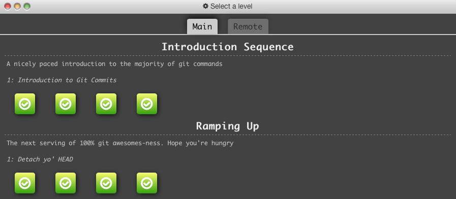

### Git basics

#### 1.1 Introduction to Git Commits

1. git commit
2. git commit

#### 1.2 Branching in Git

1. git branch bugFix
2. git checkout bugFix

#### 1.3 Merging in Git

1. git checkout -b bugFix
2. git commit
3. git checkout master
4. git commit
5. git merge bugFix

#### 1.4 Rebase Introduction

1. git checkout -b bugFix
2. git commit
3. git checkout master
4. git commit
5. git checkout bugFix
6. git rebase master

#### 2.1 Detach yo' HEAD

1. git checkout C4

#### 2.2 Relative Refs

1. git checkout bugFix^

#### 2.3 Relative Refs2

1. git checkout C6
2. git branch -f master HEAD
3. git checkout HEAD~3
4. git branch -f bugFix bugFix~3

#### 2.4 Reversing Changes in Git

1. git reset local^
2. git checkout pushed
3. git revert pushed

#### Screenshot

### Hooks

Add the following line to .git/hooks/post-commit:

 	#!bin/bash
 	
 	open https://www.ncsu.edu
 	
### Screencast

The video has been uploaded to [youtube](http://youtu.be/wdeNyPgo7zU).
